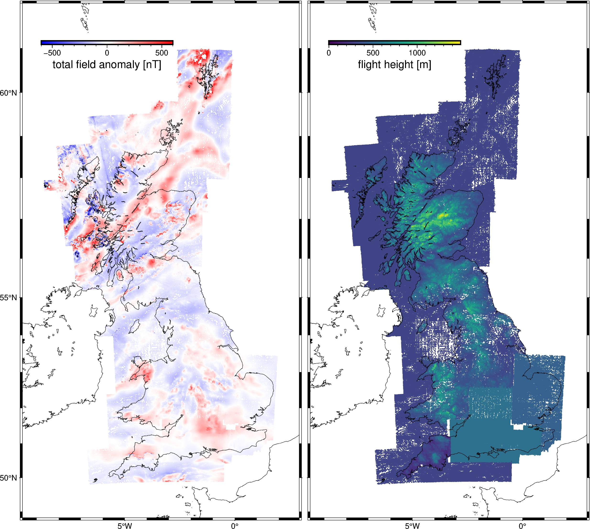

# Britain - Airborne total-field magnetic anomaly

This is a digitized version of an airborne magnetic survey of Britain. Data are
sampled where flight lines crossed contours on the archive maps. Contains only
the total field magnetic anomaly, not the magnetic field intensity measurements
or corrections.

> Contains British Geological Survey materials © UKRI 2021.

| | Summary |
|--:|:--|
| File | `britain-magnetic.csv.xz` |
| Size | 2.7 Mb |
| Version | [v1](https://github.com/fatiando-data/britain-magnetic/releases/latest) |
| DOI | https://doi.org/10.5281/zenodo.5879260 |
| License | [CC-BY](https://creativecommons.org/licenses/by/4.0/) |
| MD5 | `md5:8dbbda02c7e74f63adc461909358f056` |
| SHA256 | `sha256:4e00894c2e0fa5b9c547719c8ac08adb6e788a7074c0dae9fb1b2767cf494b38` |
| Source | [British Geological Survey](https://www.bgs.ac.uk/datasets/gb-aeromagnetic-survey/) |
| Original license | [Open Government Licence](https://www.bgs.ac.uk/bgs-intellectual-property-rights/open-government-licence/) |
| Processing code | [`prepare.ipynb`](https://nbviewer.org/github/fatiando-data/britain-magnetic/blob/main/prepare.ipynb) |

## Changes made

> These are the changes made to the original dataset.

* Datum was changed to WGS84.
* Year was separated from the survey name.
* Some fields were dropped.
* Exported to compressed CSV format.

## About this repository

This is a place to format and prepare the original dataset for use in our
tutorials and documentation.

We include the source code that prepares the datasets for redistribution by
filtering, standardizing, converting coordinates, compressing, etc.
The goal is to make loading the data as easy as possible (e.g., a single call
to `pandas.read_csv` or `xarray.load_dataset`).
Whenever possible, the code also downloads the original data (otherwise the
original data are included in this repository).

> 💡 **Tip:** The easiest way to download this dataset is using
> [Pooch](https://www.fatiando.org/pooch), particularly to download straight
> from the DOI of a release.

## Contributing

See our [Contributing Guidelines][contrib] for information on proposing new
datasets and making changes to this repository.

## License

All Python source code is made available under the BSD 3-clause license. You
can freely use and modify the code, without warranty, so long as you provide
attribution to the authors.

Unless otherwise specified, all data files and figures created by the code are
available under the Creative Commons Attribution 4.0 License (CC-BY).

See [`LICENSE.txt`](LICENSE.txt) for the full text of each license.

The license for the original data is specified in this `README.md` file.

[contrib]: https://github.com/fatiando-data/.github/blob/main/CONTRIBUTING.md
